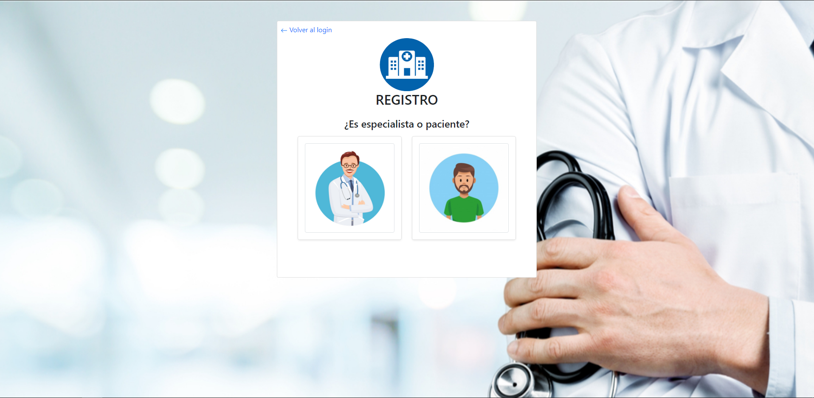
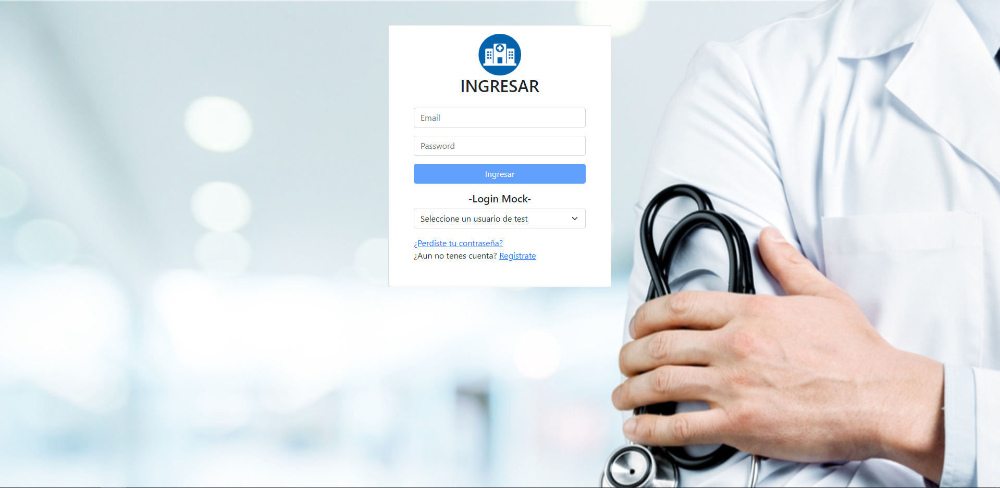
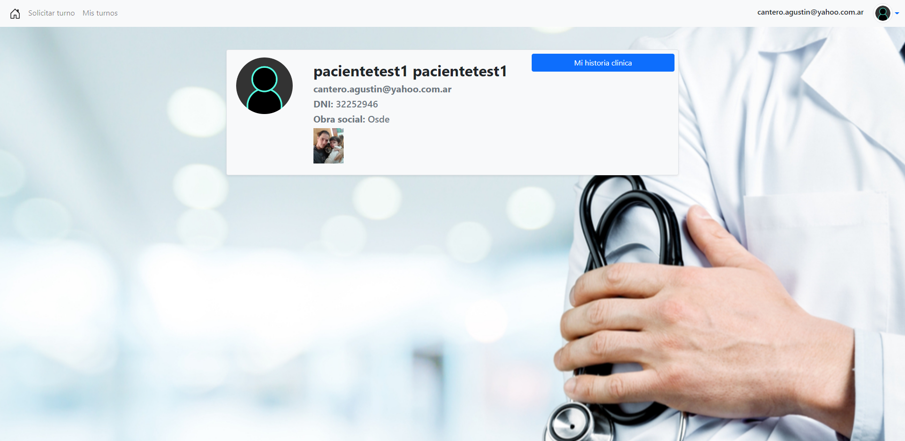
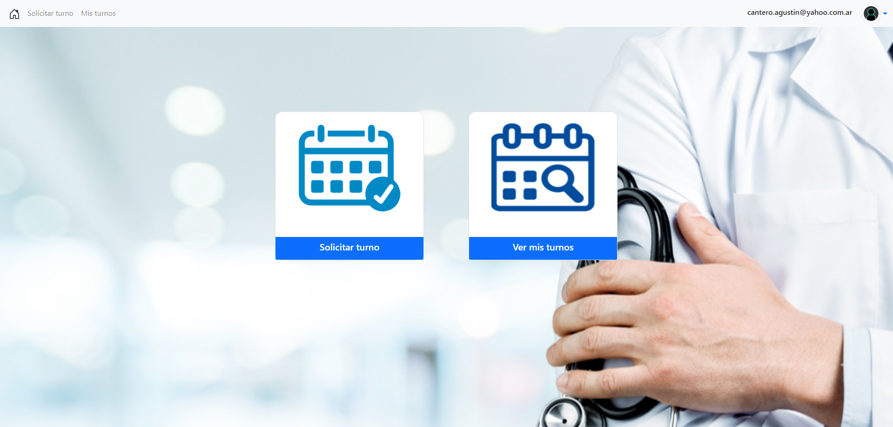

# Clínica Online

Sistema de gestión de turnos para clinicas con el que podrás brindar un servicio moderno y seguro para los pacientes, profesionales y administrativos del equipo de trabajo. 
Este proyecto fue realizado como Trabajo Practico final para la materia laboratorio 4 de la UtnFRA

# :information_source: ¿Cuáles es la funcion de la aplicación?
- Gestión de perfiles para pacientes, usuarios y administradores
- Flexibilidad de configuracion para los usuarios
- Detalle de médicos y turnos para una mejor experiencia para el paciente
- Datos estadísticos generados en base a la experiencia personal
- Generación de cartilla médica en diferentes formatos

# :information_source: ¿Cómo funciona la aplicación?

El sistema se integra con los diferentes perfiles de usuario generando una experiencia diferente para cada uno.
Cada perfil tendrá acceso a opciones que enriqueceran al sistema y a su vez facilitará la gestión de la atención médica.

# :information_source: ¿Contenido de la aplicación?

## Menu principal

Menu principal instintivo para una fácil navegación

Desde el menú principial se puede acceder a las diferentes pantallas del sistema.
- Registro : Formularios para ingresar datos de paciente y de profesional.

- Login: Ingreso para usuarios ya registrados con validación de datos

- Perfil: Pantalla con datos personales del usuario personalizado según rol.

- Menu: Comodo menu con todas las acciones al alcance de un click.

## Cartilla medica

Listado de profesionales con filtros para mayor detalle

## Registro de usuario

Ingreso de usuarios según perfil con datos validados con las ultimas tecnologias en seguridad.

- Cada usuario deberá ingresar sus datos personales y datos correspondientes a su rol como usuario.

## Detalle de los turnos

Menu con detalle de cada turno con opciones que permiten una completa interaccion.

- Filtro según estado del turno, dato a buscar o valor a buscar.

## Menu de Perfil

Pantalla de configuracion de datos personales y opciones para cada perfil de usuario

- En el menú de perfil se podrán modificar los datos personales del usuario. 
Cada menú es personalizado según el rol.

# :information_source: Link de ejemplo

Para observar una demo de la aplicación se puede ingresar al siguiente link y utilizar los perfiles pre-cargados de diferentes usuarios para explorar la funcionalidad de los diferentes roles en una experiencia de uso real.

## https://tpfinal-4cddd.web.app
